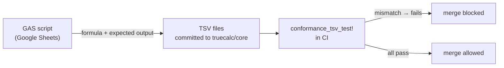
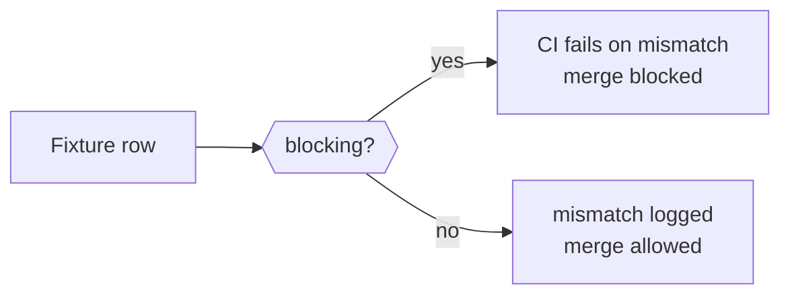

import { ConformanceTable } from '@/components/conformance-table';

## Overview

truecalc tests formula correctness against ~10,500 formulas captured from real Google Sheets runs.
The fixture TSV files are immutable ground truth — they were produced by running formulas inside
Google Sheets and recording the exact output.
CI evaluates every fixture on every PR and blocks merges on any mismatch.

## The fixture pipeline

A Google Apps Script runs formulas inside a real Google Sheets workbook and exports each formula
alongside the value Google Sheets computed for it. Those pairs are committed as TSV rows under
`crates/core/tests/fixtures/google_sheets/`. The `conformance_tsv_test!` macro in the test suite
feeds every row through the truecalc evaluator and asserts the output matches.

## Two-tier test model

Fixtures are divided into two tiers:

| Tier | Behavior | When used |
|---|---|---|
| **Blocking** | CI fails if any row regresses | All current production categories |
| **Report-only** | Failures are logged but do not block merge | WIP categories actively being fixed |

A category moves from report-only to blocking once its pass rate reaches 100% and that state is
stable across several PRs. No category can regress from blocking to report-only without an
explicit, reviewed decision.

## Known deviations (`bugs.tsv`)

Some formulas cannot pass in the current harness — not because the evaluator is wrong, but because
the test environment cannot replicate the full context Google Sheets used. For example, `=SHEETS()`
returns the number of sheets in the workbook, which depends on how many sheets the GAS script
created at capture time. Rows like this, along with formulas affected by known architecture
constraints, are recorded in `bugs.tsv`.

<Callout type="info">
  Entries in `bugs.tsv` are documented failures, not hidden ones. Each row explains why it cannot
  currently pass. When the underlying limitation is resolved, the row moves to the appropriate
  category TSV.
</Callout>

## Live conformance status

<ConformanceTable />

For a full drill-down by fixture ID, see the [conformance report](https://truecalc.github.io/core/#conformance).

## Fixture / code separation

TSV changes and code changes must travel in separate PRs — CI enforces this. The rule exists to
prevent a subtle failure mode: if fixture values could be silently updated in the same PR that
changes the evaluator, a regression could be made to "pass" simply by updating the expected value
to match the wrong output. Keeping them separate means the fixture files remain an independent
source of truth that the code must satisfy, not a file the code can rewrite to suit itself.
